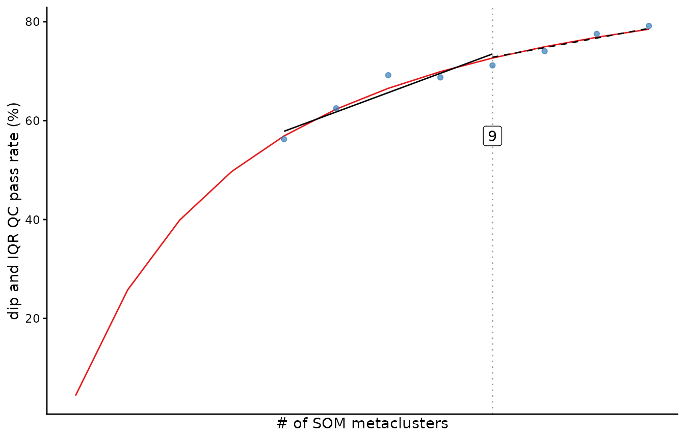
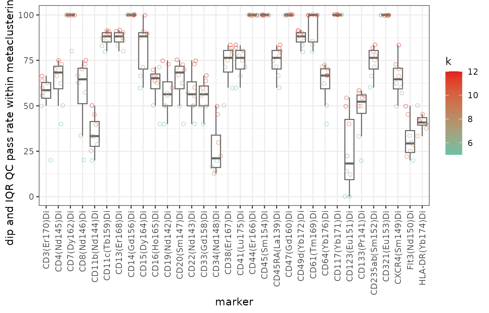

# Use and interpret fastINFLECT

fastINFLECT scans the cluster counts you request, scores marker
distributions within each partition, and reports candidate values of
`k`. The candidate values guide inspection. The retained
cluster-by-marker evidence supports the final interpretation.

## Run an analysis

To obtain these candidate values and retained evidence, start with a
completed FlowSOM or kohonen SOM. The example below uses the downsampled
Levine32 FlowSOM object included with fastINFLECT.

``` r
load(system.file(
  "extdata",
  "Levine32sample.Rdata",
  package = "fastINFLECT"
))

schedule <- 5:12

result <- INFLECT(
  FlowSOM.results = dataset,
  set.i = schedule,
  uniform.test = "both",
  progress = FALSE
)
```

`set.i` is literal. The call above evaluates every integer from 5
through 12 and stores a partition for each one. Supply at least five
unique, increasing integers, with no value above the number of SOM
nodes. Use
[`inflect_adaptive_set_i()`](https://mdmanurung.github.io/fastINFLECT/reference/inflect_adaptive_set_i.md)
when you want a denser low-k schedule with a fixed upper bound.

| Argument | Use |
|----|----|
| `uniform.test = "both"` | Build the aggregate from pairs that pass both dip and IQR criteria |
| `uniform.test = "unimodality"` | Build the aggregate from the dip criterion |
| `uniform.test = "spread"` | Build the aggregate from the IQR criterion |
| `markers = c("CD3", "CD4")` | Override the default SOM clustering markers |
| `workers = 2L` | Use two QC workers where fork-based parallelism is supported |
| `progress = TRUE` | Show stage messages and a serial progress bar |

All selected marker values must be finite. Negative and zero values are
kept unchanged. `NA`, `NaN`, `Inf`, or `-Inf` produces an early error
that reports the affected markers before metaclustering or QC scoring
starts.

For event sampling, the default analysis uses all events. Treat
`max.events.per.node` and `max.n.diptest` as sensitivity-analysis
controls. Compare several caps and seeds before using a sampled result.
fastINFLECT warns whenever either cap is active. A request for multiple
workers on an unsupported platform also warns and falls back to one
worker.

## Read candidate values

After the analysis completes, print the result for a compact view of the
run and its candidate values. The plot shows how the selected QC pass
rate changes across the tested schedule.

``` r
result
#> fastINFLECT result
#>   knee: 9
#>   range: 12
#>   angle: 12.88413
#>   tested k values: 8
#>   tested k range: 5-12
#>   markers: 32
#>   provenance: uniform.test=both
#>   k estimates and tested thresholds:
#>     inflection k=9 (71.2% QC pass) [tested_partition]
#>     kneedle    k=7 (69.2% QC pass) [tested_partition]
#>     threshold  k=NA [not_available]
plot(result)
```



The tested scores and candidate table are available as data frames.

``` r
as.data.frame(result)
#>    k qc_pass_rate criterion
#> 1  5     56.25000  combined
#> 2  6     62.50000  combined
#> 3  7     69.19643  combined
#> 4  8     68.75000  combined
#> 5  9     71.18056  combined
#> 6 10     74.06250  combined
#> 7 11     77.55682  combined
#> 8 12     79.16667  combined

result$selection[c(
  "method",
  "k",
  "qc_pass_rate_at_k",
  "partition_available",
  "k_status"
)]
#>       method  k qc_pass_rate_at_k partition_available         k_status
#> 1 inflection  9          71.18056                TRUE tested_partition
#> 2    kneedle  7          69.19643                TRUE tested_partition
#> 3  threshold NA                NA               FALSE    not_available
```

| Method       | Interpretation                                           |
|--------------|----------------------------------------------------------|
| `inflection` | Bend in the fitted diagnostic curve                      |
| `kneedle`    | Largest observed departure from a straight-line increase |
| `threshold`  | Smallest tested `k` that reaches `target`                |

Candidate rows are diagnostic summaries, not a ranking. The example
below uses the directly tested inflection candidate only to demonstrate
inspection; it is not a default recommendation. A row with
`partition_available = TRUE` was directly tested and has an entry in
`metaclustering.list`. If a finite candidate was not directly tested,
inspect `k_status`, add its `k` to a new `set.i` schedule, and rerun
before inspection. Candidate methods that happen to return the same `k`
are not independent confirmation.

## Inspect marker-level evidence

Name the candidate method, require one matching directly tested row, and
use its character value as the list key. Each pass matrix has one row
per metacluster and one column per marker.

``` r
candidate_method <- "inflection"
candidate <- result$selection[
  result$selection$method == candidate_method,
  ,
  drop = FALSE
]

if (nrow(candidate) != 1L) {
  stop("Expected exactly one inflection candidate.", call. = FALSE)
}
if (!isTRUE(candidate$partition_available[[1L]])) {
  stop(
    "Inspect `k_status`; if the candidate k is finite, add it to `set.i` and rerun.",
    call. = FALSE
  )
}

candidate_k <- candidate$k[[1L]]
key <- as.character(candidate_k)
if (!key %in% names(result$metaclustering.list)) {
  stop("The directly tested candidate partition is missing.", call. = FALSE)
}

candidate[c("method", "k", "qc_pass_rate_at_k", "partition_available", "k_status")]
#>       method k qc_pass_rate_at_k partition_available         k_status
#> 1 inflection 9          71.18056                TRUE tested_partition

partition <- result$metaclustering.list[[key]]
partition_map <- data.frame(
  som_node = seq_along(partition),
  metacluster = unname(partition)
)
head(partition_map)
#>   som_node metacluster
#> 1        1           1
#> 2        2           1
#> 3        3           1
#> 4        4           1
#> 5        5           1
#> 6        6           1
table(partition_map$metacluster)
#> 
#>  1  2  3  4  5  6  7  8  9 
#> 48  6 93 23 96 26 36 39  8

criterion_summary <- result$provenance$criterion_summary
selected_criterion_summary <- criterion_summary[
  criterion_summary$k == candidate_k & criterion_summary$selected,
  c("k", "criterion", "passed", "failed", "unresolved", "total", "qc_pass_rate"),
  drop = FALSE
]
if (nrow(selected_criterion_summary) != 1L) {
  stop("Expected exactly one selected criterion summary.", call. = FALSE)
}
selected_criterion_summary
#>    k criterion passed failed unresolved total qc_pass_rate
#> 15 9  combined    205     83          0   288     71.18056

result$criterion_pass[[key]][1:5, 1:5]
#>   CD3(Er170)Di CD4(Nd145)Di CD7(Dy162)Di CD8(Nd146)Di CD11b(Nd144)Di
#> 1         TRUE        FALSE         TRUE         TRUE          FALSE
#> 2        FALSE         TRUE         TRUE         TRUE           TRUE
#> 3         TRUE        FALSE         TRUE        FALSE          FALSE
#> 4         TRUE         TRUE         TRUE         TRUE           TRUE
#> 5        FALSE        FALSE         TRUE        FALSE          FALSE
result$dip_pass[[key]][1:5, 1:5]
#>   CD3(Er170)Di CD4(Nd145)Di CD7(Dy162)Di CD8(Nd146)Di CD11b(Nd144)Di
#> 1         TRUE        FALSE         TRUE         TRUE          FALSE
#> 2        FALSE         TRUE         TRUE         TRUE           TRUE
#> 3         TRUE        FALSE         TRUE        FALSE          FALSE
#> 4         TRUE         TRUE         TRUE         TRUE           TRUE
#> 5        FALSE        FALSE         TRUE        FALSE          FALSE
result$iqr_pass[[key]][1:5, 1:5]
#>   CD3(Er170)Di CD4(Nd145)Di CD7(Dy162)Di CD8(Nd146)Di CD11b(Nd144)Di
#> 1         TRUE         TRUE         TRUE         TRUE           TRUE
#> 2        FALSE         TRUE         TRUE         TRUE           TRUE
#> 3         TRUE         TRUE         TRUE         TRUE           TRUE
#> 4         TRUE         TRUE         TRUE         TRUE           TRUE
#> 5         TRUE         TRUE         TRUE         TRUE           TRUE
result$combined_pass[[key]][1:5, 1:5]
#>   CD3(Er170)Di CD4(Nd145)Di CD7(Dy162)Di CD8(Nd146)Di CD11b(Nd144)Di
#> 1         TRUE        FALSE         TRUE         TRUE          FALSE
#> 2        FALSE         TRUE         TRUE         TRUE           TRUE
#> 3         TRUE        FALSE         TRUE        FALSE          FALSE
#> 4         TRUE         TRUE         TRUE         TRUE           TRUE
#> 5        FALSE        FALSE         TRUE        FALSE          FALSE
```

This is an inspected candidate partition, not a scientifically selected
partition. Positions are SOM nodes and values are nominal metacluster
labels. The table counts SOM nodes, not events or cells. Labels are not
ordered scores and must not be compared numerically across different
values of `k`.

`criterion_pass[[key]]` is the matrix used to calculate `qc_pass_rate`.
It equals `dip_pass[[key]]` for `uniform.test = "unimodality"`,
`iqr_pass[[key]]` for `"spread"`, and `combined_pass[[key]]` for
`"both"`. `TRUE` passed the recorded threshold, `FALSE` did not, and
`NA` means that the selected decision was unavailable. Under `"both"`, a
definitive component failure can determine `FALSE` even if the other
component is unresolved, so inspect the component matrices and
`failure_reason` as well.

`qc_pass_rate` is `100 * passed / total` over the metacluster-by-marker
matrix selected by `uniform.test`; unresolved (`NA`) decisions remain in
`total`. Because `k`, cluster event counts, and test behavior change
across candidates, compare `passed`, `failed`, `unresolved`, and
`total`. A higher rate means only that a larger fraction passed. It does
not imply fewer absolute failures or that a partition is preferable or
biologically valid.

Interpret the screening evidence within these limits:

- Dip-test non-rejection means no detected multimodality at the recorded
  threshold, not proof of unimodality.
- IQR is a spread screen, not a unimodality test.
- Per-pair thresholds are not multiplicity-controlled inference.
- Increasing `k` changes group sizes and test behavior, so a rising
  curve is diagnostic rather than evidence that larger `k` is
  biologically better.

``` r
details <- result$qc.details[[key]]
details$dip_p_value[1:5, 1:5]
#>   CD3(Er170)Di CD4(Nd145)Di CD7(Dy162)Di CD8(Nd146)Di CD11b(Nd144)Di
#> 1 0.9942201458 0.0002713102    0.9873774  0.991133473    0.002759089
#> 2 0.0000000000 0.4085785852    0.9906014  0.686300759    0.569989988
#> 3 0.9293776443 0.0000000000    0.9513538  0.000033003    0.000000000
#> 4 0.1251159356 0.2661728135    0.9980218  0.974318468    0.300653962
#> 5 0.0004518359 0.0003636308    0.4506221  0.001991071    0.000000000
details$iqr[1:5, 1:5]
#>   CD3(Er170)Di CD4(Nd145)Di CD7(Dy162)Di CD8(Nd146)Di CD11b(Nd144)Di
#> 1    0.8566725    0.2382634   1.70326701    0.8563761      0.4517324
#> 2    4.4798380    0.5393102   1.01360329    1.4872751      1.1631696
#> 3    0.8918539    0.9669128   1.76956461    0.2957914      0.3571555
#> 4    0.3293855    0.1539406   1.49905356    0.6288621      0.7997717
#> 5    0.4021029    0.3683224   0.08655342    0.1506214      1.8180357
table(details$failure_reason, useNA = "ifany")
#> 
#> <NA> 
#>  288
```

Use marker summaries next to check whether a small set of markers drives
the aggregate curve.

``` r
marker_qc <- marker.performance(result)
head(marker_qc$marker.dataframe)
#>    k       marker qc_pass_rate  i       Marker Performance
#> 1  5 CD3(Er170)Di     20.00000  5 CD3(Er170)Di    20.00000
#> 2  6 CD3(Er170)Di     50.00000  6 CD3(Er170)Di    50.00000
#> 3  7 CD3(Er170)Di     57.14286  7 CD3(Er170)Di    57.14286
#> 4  8 CD3(Er170)Di     62.50000  8 CD3(Er170)Di    62.50000
#> 5  9 CD3(Er170)Di     55.55556  9 CD3(Er170)Di    55.55556
#> 6 10 CD3(Er170)Di     60.00000 10 CD3(Er170)Di    60.00000
marker_qc$plot
```



## Report the result

After inspecting the marker-level evidence, record the settings that
define the run before reporting a candidate. The provenance includes the
schedule, marker panel, criterion, thresholds, value handling, sampling,
seed, and worker backend.

``` r
result$provenance[c(
  "set.i",
  "markers",
  "marker_selection",
  "uniform.test",
  "th.pvalue",
  "th.IQR",
  "value_handling",
  "parallel",
  "max.n.diptest",
  "max.events.per.node",
  "seed"
)]
#> $set.i
#> [1]  5  6  7  8  9 10 11 12
#> 
#> $markers
#>  [1] "CD3(Er170)Di"     "CD4(Nd145)Di"     "CD7(Dy162)Di"     "CD8(Nd146)Di"    
#>  [5] "CD11b(Nd144)Di"   "CD11c(Tb159)Di"   "CD13(Er168)Di"    "CD14(Gd156)Di"   
#>  [9] "CD15(Dy164)Di"    "CD16(Ho165)Di"    "CD19(Nd142)Di"    "CD20(Sm147)Di"   
#> [13] "CD22(Nd143)Di"    "CD33(Gd158)Di"    "CD34(Nd148)Di"    "CD38(Er167)Di"   
#> [17] "CD41(Lu175)Di"    "CD44(Er166)Di"    "CD45(Sm154)Di"    "CD45RA(La139)Di" 
#> [21] "CD47(Gd160)Di"    "CD49d(Yb172)Di"   "CD61(Tm169)Di"    "CD64(Yb176)Di"   
#> [25] "CD117(Yb171)Di"   "CD123(Eu151)Di"   "CD133(Pr141)Di"   "CD235ab(Sm152)Di"
#> [29] "CD321(Eu153)Di"   "CXCR4(Sm149)Di"   "Flt3(Nd150)Di"    "HLA-DR(Yb174)Di" 
#> 
#> $marker_selection
#> [1] "clustering_markers"
#> 
#> $uniform.test
#> [1] "both"
#> 
#> $th.pvalue
#> [1] 0.05
#> 
#> $th.IQR
#> [1] 2
#> 
#> $value_handling
#> $value_handling$rule
#> [1] "require finite QC marker data and retain all values unchanged"
#> 
#> $value_handling$validation
#> [1] "passed"
#> 
#> 
#> $parallel
#> $parallel$use_parallel
#> [1] FALSE
#> 
#> $parallel$requested_workers
#> [1] 1
#> 
#> $parallel$effective_workers
#> [1] 1
#> 
#> $parallel$backend
#> [1] "serial"
#> 
#> $parallel$os_type
#> [1] "unix"
#> 
#> 
#> $max.n.diptest
#> [1] NA
#> 
#> $max.events.per.node
#> [1] NA
#> 
#> $seed
#> [1] 1
```

Use language that matches the evidence:

| Result | Report as |
|----|----|
| High `qc_pass_rate` | A larger fraction passed the selected QC criterion; report the counts |
| `dip_pass = FALSE` | The dip test detected evidence against unimodality at the recorded threshold |
| `iqr_pass = FALSE` | The marker IQR met or exceeded the recorded spread threshold |
| `dip_pass = TRUE` | No multimodality was detected by this dip test |
| Candidate `k` | A diagnostic candidate that still requires stability and biological review |

A criterion pass is a screening result. It does not prove unimodality,
multivariate cluster homogeneity, or biological validity. Report the
selected criterion and thresholds, confirm that the partition was
directly tested, and describe marker-level failures or unresolved
measurements alongside the chosen `k`.
